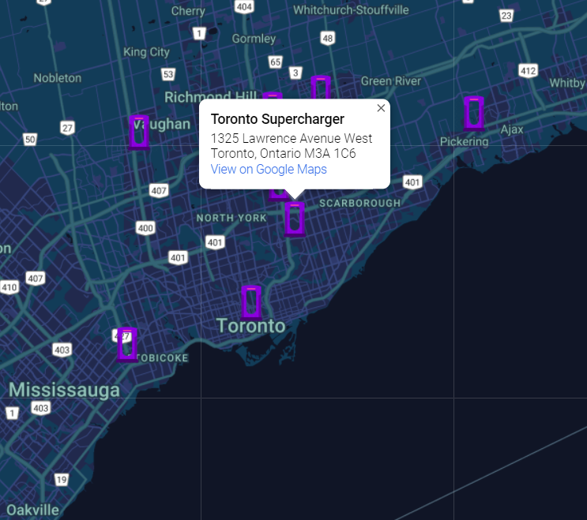

## Supercharger-Finder

Map search application capable of locating of eletric vehicle charging stations.

## Code
Written with HTML, CSS, and Javascript. 
Feeds Google geolocation data into the OpenChargeMap API to look for nearby ports. Then results are displayed as markers onto Google maps. 

## Preview

Two day project created for [WinHacks 2022](https://devpost.com/software/tesla-supercharger-finder?ref_content=my-projects-tab&ref_feature=my_projects).
